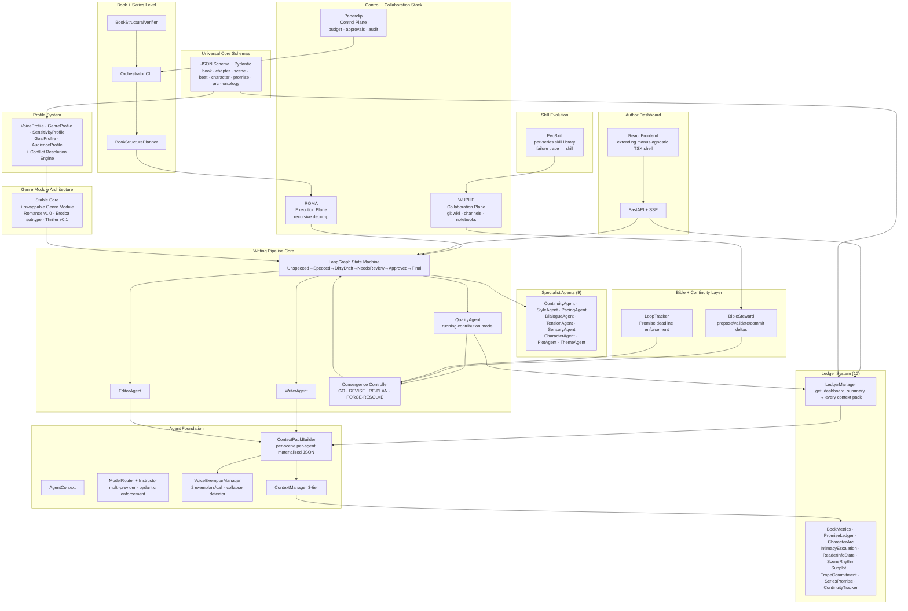

# Fiction-Factory Architecture

**Revision:** 2026-05-15 — Post-synthesis, pre-implementation  
**Synthesis shape:** Shared core + per-track genre modules  
**V1 target:** Romance Module v1.0 (validated), Erotica subtype, Thriller v0.1 scaffold, series production loop, Author Dashboard, EvoSkill pattern accumulation  
**Design target:** Full-auto operation (S4) — architecture is engineered toward it from day one

---

## System Diagram



---

## Directory Layout

```
fiction-factory/
├── schemas/
│   ├── universal/          # 7 JSON Schema files (Phase 2)
│   └── ledgers/            # 7 ledger event schemas (Phase 3)
│   └── profiles/           # 5 profile schemas (Phase 4)
├── profiles/
│   ├── author/             # VoiceProfile YAML files
│   ├── genre/              # romance_module_v1.yaml, erotica_module_v1.yaml, thriller_module_v01.yaml
│   ├── sensitivity/        # content policy YAML
│   ├── goal/               # kdp_commercial.yaml
│   └── audience/           # reader persona YAML
├── pipeline/
│   ├── schemas/universal/  # pydantic models generated from schemas/universal/
│   ├── core/               # AgentContext, ModelRouter, VoiceProfile, ContextManager, ContextPackBuilder,
│   │                       # BaseAgent, JobContext, ProjectLayout
│   ├── ledgers/            # LedgerManager + 10 ledger implementations (SQLite-backed)
│   ├── profiles/           # ProfileRegistry, ConflictResolver
│   ├── continuity/         # BibleSteward, LoopTracker
│   ├── evoskill/           # TraceCollector + EvoSkill adapter
│   ├── control/            # PaperclipClient, WUPHFClient
│   ├── scene_state_machine.py   # LangGraph graph
│   ├── convergence_controller.py
│   ├── context_pack_builder.py
│   ├── voice_exemplar_manager.py
│   ├── spec_loader.py
│   ├── book_structure_planner.py
│   ├── book_structural_verifier.py
│   ├── orchestrator.py     # thin CLI
│   └── job_runner.py
├── agents/                 # WriterAgent, EditorAgent, QualityAgent + 9 specialist agents
├── api/                    # FastAPI backend (Phase 13)
├── dashboard/              # React frontend (Phase 13)
├── tests/
│   └── eval/               # DeepEval custom metrics
├── data/
│   ├── cost_log.jsonl
│   └── ledgers/            # SQLite ledger files (per series)
├── model_router.json       # tier config; default: test
├── pyproject.toml
├── Makefile
└── .env.example
```

---

## Layer 1 — Universal Core Schemas

**Source:** Starter ontology v3 (Phases 2–3). JSON Schema Draft 2020-12 canonical; pydantic models generated from schemas.

**Principle:** Schemas are the contract. Every component validates input and output. Schema validation failures auto-retry; persistent failures become FORCE-RESOLVE entries with logging.

| Schema file | Entities |
|---|---|
| `voice_axes.schema.json` | All 9 axis categories; ranges, units |
| `structural_hierarchy.schema.json` | Generic Unit, Beat, Scene, Chapter, Act, Book, Series (6 levels) |
| `continuity_model.schema.json` | Character, Location, Object, Concept, Faction, Timeline |
| `promise_ledger.schema.json` | Promise object: foreshadowing, chekhov_object, character_question, mystery_thread, emotional_debt, thematic_setup, romantic_tension, world_question, series_thread |
| `ai_tell_catalog.schema.json` | Pattern entry: severity 1–5, context flags. Includes 4 MBSE craft-review additions: triple restatement, abstract emotion-labeling, "It is X a Y" construction, prose explaining itself |
| `specificity_heuristics.schema.json` | Metric definitions |
| `convergence.schema.json` | Decision rule: GO / REVISE / RE-PLAN / FORCE-RESOLVE with conditions |

Pydantic models are generated: `datamodel-code-generator --input schemas/universal/ --output pipeline/schemas/universal/`

No sentinel strings survive schema validation. Any field equaling `"REQUIRED — fill in"` → rejected at `--validate-spec`.

---

## Layer 2 — Ledger System

**Implementation:** 10 append-only SQLite event logs. LedgerManager wraps all 10, provides `update(scene_result)` and `get_dashboard_summary(book_id, scene_id) → AuthorDashboard`. The dashboard summary is injected into every scene's context pack.

**Evaluation model:** QualityAgent evaluates a scene's *contribution to the running book total*, not a local absolute value. A high-interiority scene passes if the running total is below target. The context pack includes: current running total, target, budget remaining.

| Ledger | Purpose | Key tracked fields |
|---|---|---|
| **BookMetricsLedger** | Running cumulative stylometrics after each finalized scene. Primary pacing-failure detector | `interiority_pct`, `sensory_density_per_1k`, `em_dash_density`, `dialogue_ratio`, `heat_curve_position`, `ai_tell_count`, `no_fly_violations`, `sex_scene_flag`, `sex_scene_count_running`, `sentence_length_avg`, `exposition_pct`, `action_pct`, `word_count` (by act/chapter), `scene_id`, `chapter_id` |
| **PromiseLedger** | Per-book narrative promise lifecycle; overdue detection enforced before any chapter ships | `promise_id`, `type`, `opened_at`, `target_resolution`, `resolved_at`, `status` |
| **Bible/ContinuityTracker** | Canonical facts about world/characters; content-hash chain; per-book snapshot | `fact_id`, `entity_type`, `entity_id`, `field`, `value`, `committed_at`, `hash` |
| **CharacterArcLedger** | Psychological arc position per character; prevents writing chapter 22 without knowing arc phase | `character_id`, `arc_position` (opening/wound_open/processing/wound_healing/resolved), `wound_state`, `core_belief_current`, `core_belief_true`, `relationship_states` (dict: other_char_id → status) |
| **IntimacyEscalationLedger** | Ordered history of intimacy events per character pair; prevents duplication and enforces escalation | `pair_id`, per-event: `chapter`, `scene`, `act_type` (first_touch/first_charged_moment/first_kiss/first_explicit/escalation_peak), `heat_level`, `notes` |
| **ReaderInformationStateLedger** | What the reader knows vs. what each character knows; tracks dramatic irony and revelations | `fact_id`, `revealed_at` (chapter/scene), `known_by_reader: bool`, `known_by_characters: list[char_id]`, `irony_type` (dramatic/tragic/situational/none) |
| **SceneRhythmLedger** | Rolling window of last 10 scene types; prevents 5 introspection scenes in a row | Maintained as a list in LedgerManager state; no separate schema |
| **SubplotLedger** | Subplots opened with target resolution chapters; distinct from PromiseLedger | `subplot_id`, `type` (romantic/professional/family/external), `opened_at`, `target_resolution_chapter`, `status` (open/escalating/complicating/resolved), `resolution_scene` |
| **TropeCommitmentLedger** | Genre-specific tropes activated with required payoff beats | `trope_id`, `genre_module`, `activated_at`, `required_beats` list (`beat_id`, `description`, `target_chapter`, `status`: pending/fulfilled/overdue) |
| **SeriesPromiseLedger** | Cross-book version of PromiseLedger for multi-book series arcs | `promise_id`, `type`, `opened_book`, `opened_chapter`, `must_resolve_by_book`, `resolution_status` |

**SQLite safety:** BibleSteward commits use `os.replace` + exclusive lock. All ledger writes are atomic appends. No ledger row is ever modified after insert.

---

## Layer 3 — Profile System

**5 profile types.** All profiles are YAML data files; code reads them. Conflict resolution engine enforces precedence at composition time.

| Profile | Schema | Key fields |
|---|---|---|
| **VoiceProfile** | `author_profile.schema.json` | 9 axis categories: sentence-level, lexical, syntactic, dialogue, sensory, pacing, metaphor, subtext, cadence; `forbidden_constructions` (regex + severity); `enforcement_weights`; `calibration_history`. Source: Bunko schema 15 sections |
| **GenreProfile** | `genre_profile.schema.json` | `scene_function_vocabulary`, `required_scene_slots`, `quality_gates`, `self_audit_rubric`, `heat_scale`, `structural_conventions`, `trope_library`, `reader_contract` |
| **SensitivityProfile** | `sensitivity_profile.schema.json` | Content domain policies, vocabulary restrictions, audience markers, hard thresholds. **Sacred: Goal cannot loosen Sensitivity thresholds. Violations → RE-PLAN only, never FORCE-RESOLVE** |
| **GoalProfile** | `goal_profile.schema.json` | Intent (kdp_high_revenue / literary_award_target / personal_vanity), conflict precedence weight overrides, success criteria |
| **AudienceProfile** | `audience_profile.schema.json` | Reader lens, tolerance bands, expectation set, trigger sets, 3–5 named reader personas |

**Conflict precedence (binding, non-negotiable):**  
`Constraint > Sensitivity > Goal > Genre > Audience > Author > Universal`

**ProfileRegistry** composes profiles into a `ProjectSpec`. All agents read `ProjectSpec`; no agent reads raw profiles directly. All conflicts resolved at composition time are logged to `DECISIONS.md`.

**V1 genre modules:**

| Module | Status | Key parameters |
|---|---|---|
| Romance Module v1.0 | Production-validated | HEA/HFN required; `heat_level` (RWA scale) + `tonal_mode`; `heat_curve`; `meet_cute_spec`; `grand_gesture_spec`; `consent_arc`; `black_moment` or `dark_night`; required trope slots |
| Erotica subtype | Production (within Romance Module) | NOT a separate track. Parameterization: `heat_level=erotic`, `heat_curve` steep (first sex scene by chapter 2), `interiority_budget_pct_max=0.20`, `exposition_budget_pct_max=0.15`, `sex_scene_frequency_min=1_per_3_chapters`, escalation rule: no repeated beat type within 3 scenes, elevated sensory density targets |
| Thriller Module v0.1 | Scaffold only, not production-validated | `knowledge_state` per character, evidence object ledger, relationship tracking (true vs performed), `thriller_engine` block per scene |

---

## Layer 4 — Agent Foundation

### AgentContext

Every agent constructor takes `AgentContext(project_layout, spec_loader, ledger_manager, log_path, output_dir, model_tier)`. No agent assembles a path by hand — all paths via `ProjectLayout`. All agents receive and return a typed `JobContext` dataclass (no plain dict passing).

### ModelRouter + Instructor

Every Claude API call goes through Instructor for pydantic schema enforcement and validation retries. No raw `response_format` calls. Cost is logged to `data/cost_log.jsonl` per call.

**Model tiers:**

| Tier | Models | When |
|---|---|---|
| `test` | Haiku 4.5, gpt-4.1-mini, Ollama phi3.5 | All LLM calls during development and integration testing |
| `production` | Sonnet 4.6 (drafter), Opus 4.7 (nuanced critics), Haiku 4.5 (mechanical critics) | Only when architecture is stable and prose quality testing begins |

`model_router.json` defaults to `test`. Never promote to production mid-integration-test.

### VoiceExemplarManager

Per Dr. Smith's spec (binding):
- 2 exemplars per call, 200–400 word window
- 3-tier source hierarchy; uniform random rotation; beat-type stratification hook
- Provenance tracked per generated scene
- **Hard invariant: no generated content may be auto-added to exemplar pool.** Attempting this raises `ValueError`.
- Collapse detector required (alert when exemplar pool diversity drops below threshold)
- Exemplar pool pre-screened against AI-tell register (Register 2)

### ContextPackBuilder (Overlay + Context Pack architecture)

`SpecLoader` returns the canonical spec with per-agent JSON-Patch overlays applied at read time. No copy-on-init. No `--init-series` step.

`ContextPackBuilder` materializes a small, self-contained, hash-stamped JSON context pack per agent per scene. Contents:
- Agent-specific spec view (overlay applied)
- Author Dashboard summary from LedgerManager (all 10 ledger states, running totals, targets, budget remaining)
- Voice exemplars (2, from VoiceExemplarManager)
- Three-tier context: scene-level / book-level / series-level (size-limited per tier)
- `provenance.json`: `source_file_hashes`, `view_schema_version`, `generated_at`, `agent_id`

Context pack delivery to agents is the first priority for the data layer; dashboard display is secondary.

### Claude Managed Agents

- **Subagent pattern:** Context isolation per agent role (writer/editor/critic/continuity). Each subagent returns only a summary to avoid context blowout on 80K-word runs.
- **Persistent memory:** Filesystem-backed, rollback-capable notes across sessions. Accumulates character facts, voice profile state, world-bible deltas.
- **Files API:** World bible (WUPHF wiki export), voice profile, character sheets uploaded once per series init. Agents reference by `file_id`, not re-injection.
- **Message Batches API:** 50% cost reduction. Use for: bulk scene generation, multi-pass editing, eval sweeps, nightly EvoSkill pass.

---

## Layer 5 — Writing Pipeline Core

### LangGraph State Machine

Scene lifecycle managed as a LangGraph graph with SQLite checkpoint persistence (pause/resume). Nodes are lifecycle states; edges have guard conditions.

```
Unspecced → Specced → DirtyDraft → NeedsReview → Approved → Final
```

### Core Agents

| Agent | Role | Notes |
|---|---|---|
| WriterAgent | Drafts scene from ContextPack | Instructor-wrapped; test tier = Haiku 4.5 |
| EditorAgent | Line edits against VoiceProfile `forbidden_constructions` | Instructor-wrapped |
| QualityAgent | Evaluates scene contribution to running BookMetricsLedger totals; updates all 10 ledgers | Fail-closed: any evaluator exception → `needs_review`, never silent pass |

### Convergence Controller

Decision routing after QualityAgent evaluation:

| Decision | Trigger |
|---|---|
| GO | All quality gates pass; contributions within budget |
| REVISE | Quality gate soft failure; retries remain |
| RE-PLAN | Sensitivity violation; Bible contradiction; overdue promise exhausted retries; structural infeasibility |
| FORCE-RESOLVE | Budget exhausted; logged entry created; never used for Sensitivity violations |

**The controller never halts.** Sensitivity violations are RE-PLAN only — they cannot become FORCE-RESOLVE entries.

### Specialist Agents (9, from manus-agnostic)

ContinuityAgent, StyleAgent, PacingAgent, DialogueAgent, TensionAgent, SensoryAgent, CharacterAgent, PlotAgent, ThemeAgent. All ported to AgentContext + Instructor + ContextPack pattern.

---

## Layer 6 — Bible + Continuity Layer

### BibleSteward

Operations: `propose_delta`, `validate_delta`, `commit_delta`, `query`.

Contradiction types detected: type-mismatch, timeline-violation, spatial, capability, voice, taboo.

`commit_delta`: atomic `os.replace` + exclusive lock + append-only event log + content-hash chain + per-book snapshot.

Bible contradiction → RE-PLAN (hard fail, routed by Convergence Controller).

### LoopTracker

- Enforces PromiseLedger deadlines: no chapter ships with overdue promises.
- Tracks Series Promise Ledger for cross-book arcs.
- Overdue promise → REVISE (soft fail) up to N attempts, then RE-PLAN.
- Series arc update failure is fatal by default (`publishing.require_series_arc_update: true`).

---

## Layer 7 — Book + Series Level

**ROMA** drives the planning phase: recursive Atomizer/Planner/Executor/Aggregator/Verifier decomposition — series → book → act → chapter → scene → beat. LangGraph manages per-scene execution state.

**BookStructurePlanner:** Reads series + book spec; generates full scene inventory with act/chapter/scene assignments, word targets, heat level per scene derived from heat_curve.

**BookStructuralVerifier:** Checks word count, act proportions, scene count, heat_curve compliance, HEA/HFN (Romance module), sex_scene frequency (Erotica subtype), all RTM requirements.

**Orchestrator CLI commands:** `--validate-spec`, `--init-book`, `--job`, `--resume`, `--verify-book`, `--book-publish`, `--status`.

Series is the primary production unit (Bunko posture). Each series is modeled as a Paperclip "company."

---

## Layer 8 — Control + Collaboration Stack

### Paperclip (control plane)

- Monthly token/dollar budget caps per agent role.
- Approval gates: spec sign-off before `--init-book`; manuscript sign-off before `--book-publish`.
- Immutable audit ledger; heartbeat scheduling for pipeline health.
- Pipeline pauses if budget exceeded — no silent overrun.

### WUPHF (collaboration plane)

- Git-backed `series-bible` wiki: character cards, world facts, voice profile.
- `pipeline` channel (production rooms: one per book); `drafts` channel; activity stream (audit log of all agent actions).
- BibleSteward commits canonical fact deltas to the wiki via git. Series spec is the source of truth in the wiki.
- EvoSkill-promoted patterns are written to the `series-bible` wiki as editorial guidelines.

### ROMA (execution plane)

Recursive Atomizer/Planner/Executor/Aggregator/Verifier. Use for hierarchical task decomposition in the planning phase. LangGraph handles per-scene execution state.

---

## Layer 9 — Skill Evolution (EvoSkill)

**Fiction-domain trace adaptation:**
- "Failure trace": any scene where a downstream critic scores below threshold OR QualityAgent routes to REVISE/RE-PLAN.
- "Success trace": scenes that passed without REVISE.
- Per-series namespace in EvoSkill git-branch versioning: `series/{series_id}/skills/`.

**Nightly pass (cron):** Proposer analyzes failure traces → classifies error mode → proposes new skill → Evaluator benchmarks on fixture corpus → Frontier Pareto-keeps best variants.

**Promotion:** Approved skills promoted to WUPHF `series-bible` wiki as editorial guidelines.

**Claude Managed Agents "Dreaming":** Research preview. If it reaches GA, evaluate as an alternative to EvoSkill's nightly pass. Keep whichever produces better per-series improvements.

---

## Layer 10 — Author Dashboard

**Backend:** FastAPI + SSE  
**Frontend:** React (extending manus-agnostic ~21 TSX/TS files)

### API endpoints

| Endpoint | Purpose |
|---|---|
| `GET /runs/{run_id}/status` | Current pipeline state: active scene, current agent, routing decisions |
| `GET /runs/{run_id}/stream` | SSE live updates |
| `GET /books/{book_id}/ledgers` | All 10 ledger states |
| `GET /books/{book_id}/metrics/history` | Chapter-by-chapter metric trajectory |
| `GET /series/{series_id}/promises` | Series Promise Ledger |
| `GET /series/{series_id}/evoskill` | Accumulated skill library |
| `GET /books/{book_id}/quality_gates` | Scene-by-scene quality gate decision history |

### Live View

| Component | Displays |
|---|---|
| `RunMonitor.tsx` | Current run: agent, scene, routing decision, Paperclip cost vs budget |
| `LedgerDashboard.tsx` | All 10 ledger states with targets and budget remaining; configurable metric plotting at chapter/scene/beat granularity |
| `QualityFeed.tsx` | Live stream of quality gate decisions via SSE |

### Historical View

| Component | Displays |
|---|---|
| `MetricTrajectory.tsx` | Line chart: interiority%, sensory density, heat curve, etc. chapter-by-chapter |
| `PromiseLedger.tsx` | All promises: open, resolved, overdue; timeline view |
| `IntimacyTimeline.tsx` | Character pair intimacy escalation map |
| `SeriesTimeline.tsx` | Cross-book series promise and arc tracker |
| `VoiceCalibration.tsx` | Voice profile calibration history across books |
| `SkillLibrary.tsx` | EvoSkill accumulated patterns per series |

Per-character dialogue metrics available: sentence length, vocabulary register, contraction rate (for voice differentiation).

`make dashboard` starts FastAPI backend + React dev server.

---

## Data Flow — Scene Generation Loop

How a beat goes from spec to `Final`:

```
1. ROMA decomposes series spec → book plan → scene inventory
   BookStructurePlanner generates scene inventory with word targets, heat_level per scene

2. Orchestrator dispatches scene job (typed JobContext)
   LangGraph state machine: scene enters Unspecced state

3. SpecLoader (Unspecced → Specced)
   - Loads canonical series spec + book spec; validates against JSON Schema
   - Applies per-agent JSON-Patch overlays at read time (no copy-on-init)
   - Rejects sentinel strings; validates all profile fields

4. ContextPackBuilder materializes context pack for WriterAgent
   - Agent-specific spec overlay
   - LedgerManager.get_dashboard_summary(): all 10 ledger states, running totals, targets, budget
   - 2 voice exemplars from VoiceExemplarManager
   - 3-tier context (scene/book/series, size-capped)
   - provenance.json: source_file_hashes, view_schema_version, generated_at, agent_id

5. WriterAgent (Specced → DirtyDraft)
   - Anthropic API call via Instructor (pydantic schema enforcement + validation retries)
   - Returns typed JobContext with draft scene
   - model_tier = test → Haiku 4.5; production → Sonnet 4.6

6. EditorAgent
   - Line edits against VoiceProfile forbidden_constructions (regex match)
   - NoFlyScanner + structural_analysis (deterministic; no Instructor)
   - Returns revised scene

7. Specialist Agents (parallel-eligible)
   - Each receives its own ContextPack (same overlay system)
   - Each returns only a summary (not the full scene) to avoid context blowout

8. QualityAgent (DirtyDraft → NeedsReview or retry)
   - Calls QualityEvaluator.evaluate_scene_contribution(scene_metrics, running_totals, targets, word_count_remaining)
   - High-interiority scene passes if running interiority_pct total is below target
   - Updates all 10 ledgers via LedgerManager.update(scene_result) after finalization
   - Any evaluator exception → needs_review (fail-closed, never silent pass)

9. Convergence Controller
   - GO → scene advances to Approved
   - REVISE → back to WriterAgent with feedback (retry budget permitting)
   - RE-PLAN → BibleSteward / LoopTracker / spec revision; scene replanned
   - FORCE-RESOLVE → logged; scene marked Final with caveat (budget exhausted path only)

10. BibleSteward (on Approved)
    - Extracts proposed bible deltas from scene
    - Validates deltas for contradiction (type-mismatch, timeline, spatial, capability, voice, taboo)
    - Commits: atomic os.replace + exclusive lock + append event + hash chain
    - Contradiction → RE-PLAN

11. LangGraph checkpoints state (Approved → Final)
    - SQLite checkpoint: run is pauseable/resumable at any state
    - Final scene written to output_dir via ProjectLayout

12. LedgerManager.update() posts all ledger events (BookMetrics, CharacterArc, etc.)
    Author Dashboard SSE stream fires with updated state

13. LoopTracker checks: no overdue promises before chapter ships
    Series arc update required (publishing.require_series_arc_update: true)

14. Nightly EvoSkill pass
    - TraceCollector formats scene traces (agent I/O, routing decisions, quality scores)
    - Proposer analyzes failure traces → classifies error mode → proposes skill
    - Evaluator benchmarks; Frontier Pareto-keeps
    - Approved skills promoted to WUPHF series-bible wiki
```

---

## Key Architectural Decisions (Non-Negotiable)

| Decision | Rule |
|---|---|
| Heavier-weight from the start | Under full-auto operation every silent-failure path is a manuscript-corruption path. Where two implementations exist, choose the more robust one. |
| Schemas are the contract | Every component input/output validates against a schema. No exceptions. |
| Sensitivity Profile is sacred | Goal cannot loosen Sensitivity thresholds. Sensitivity violations → RE-PLAN only, never FORCE-RESOLVE, never halts. |
| No prose retention from external sources | Voice extraction = measurement only. Source prose enters, axes computed, prose discarded. |
| No human gates in inner generation loop | Convergence Controller is fully autonomous. Two human gates only: spec authoring + post-run review. |
| Permanent line-editor release gate | No book is marked release-ready by the system alone. Human line-editor review is a permanent gate. |
| Reproducibility first-class | Every run pins: seed, model version, profile version, registry snapshot. Same inputs + seed = bit-identical outputs. |
| Fail-closed everywhere | No API key → hard failure. Any evaluator exception → needs_review. Series arc update failure → fatal. |
| Instructor on every Claude call | No raw `response_format`. Instructor handles schema enforcement + validation retries. |
| test tier during development | All LLM calls use Haiku/gpt-mini/Ollama until architecture is stable. |
| VoiceExemplarManager hard invariant | Generated content is never auto-added to the exemplar pool. This raises ValueError. |
| Context Pack, not context injection | LedgerManager summary + exemplars + overlays are delivered via materialized ContextPack, not via raw bible injection into prompts. |

---

## V1 vs V2 Scope

### V1 (this implementation plan)

- Romance Module v1.0 (validated), Erotica subtype, Thriller v0.1 scaffold
- Series production loop with all 10 ledgers
- Author Dashboard (Live View + Historical Browse)
- EvoSkill pattern accumulation (per-series skill library)
- Claude Managed Agents: subagents, persistent memory, Files API, Message Batches API
- No fine-tuning; single drafter model per scene

### V2 (deferred)

| Feature | Blocker |
|---|---|
| Ensemble drafting (GPT-5/Gemini/Drafter D) | Requires calibration corpus from V1 runs |
| Drafter D LoRA fine-tuning (Unsloth SFT → Axolotl DPO) | Requires GPU + V1 calibration corpus |
| Reception tier (Apify/Composio/Reddit/X) | Requires published books + reader reviews |
| Voice Discriminator (local Qwen 2.5 7B classifier) | Requires fine-tuning data |
| harbor eval suite (ratcheting probes) | V2 at production scale; DeepEval covers V1 |
| Signing/watermarking (Sigstore/MarkLLM/OML) | V2 when publishing |
| Temporal durable execution | Only if LangGraph checkpointing proves insufficient for 20+ book runs |
| Additional genre modules (literary, sci-fi, fantasy, mystery) | Each requires a working author for validation |
| EvoSkill → Claude Dreaming handoff | If Dreaming GA outperforms EvoSkill on fiction traces |

---

## Dependency Stack

```
# Core LLM + schema enforcement
anthropic  openai  instructor  pydantic  jsonschema  datamodel-code-generator  pyyaml

# Testing + quality
pytest  pytest-cov  mypy  ruff  pre-commit  deepeval

# Orchestration + state machine
langgraph  roma-dspy

# Memory
mem0ai

# ML (V1 scope)
scikit-learn  scipy  sentence-transformers  numpy

# Infrastructure (self-hosted)
# Paperclip — Docker compose (paperclipai/paperclip)
# WUPHF — single Go binary (nex-crm/wuphf)
# EvoSkill — pip install evoskill (sentient-agi/EvoSkill)
# Ollama — phi3.5 (test tier local model)

# MCP servers
# memory  filesystem  git
```

Python 3.12 (system). `uv` 0.11.14 for dependency management. `ANTHROPIC_API_KEY` from environment or `~/.claude/.credentials.json`. Local dev only for V1 — no cloud, no hosted services unless opted in.
